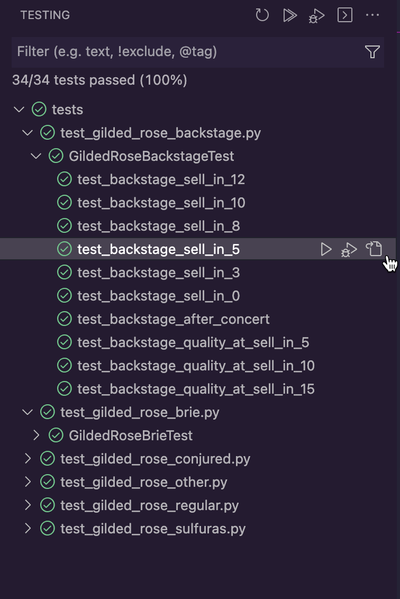

# Gilded Rose Kata in Python

This is a refactoring exercise based on the famous [GildedRose-Refactoring-Kata](https://github.com/emilybache/GildedRose-Refactoring-Kata) repository maintained by Emily Bache. This kata contains simple code in many different programming languages that need to be refactored and improve code quality. 

The source program has two classes `GildedRose` and `Item`. The `Item` class describes the properties of an item and contains the attributes - `name`, `sell_in`, and `quality`. The GildedRose class has a method `update_quality()` that updates the `sell_in` date and `quality` of the items on a regular basis. 

# Requirements

The existing codebase provides support for three products, however, the addition of a new product *Conjured* breaks the existing business logic and hence needs remodeling. There are a few business rules and constraints that need to be taken care of while refactoring the code.

## Business Rules

1. All items will have the three attributes as follows:
    1. `name` - Name of the item.
    2. `sell_in` - The number of days within which the item should be sold off.
    3. `quality` - The quality of the item; denoted by an integer.
2. Every day, the method `update_quality()` is executed, which lowers the values for `sell_in` and `quality` each.
3. Once the `sell_in` date has passed, the value for `quality` degrades twice faster.
4. There are also rules for each of the items that are currently present which are as follows.
    1. *AgedBrie* increases its `quality` with a decrease in `sell_in` value.
    2. *BackstagePasses* has the following two rules:
        1. When `sell_in` value is more than **10**, `quality` increases by **1**.
        2. When `sell_in` value is less than **10**, `quality` increases by **2**.
        3. When `sell_in` value is less than **5**, `quality` increases by **3**.
        4. When `sell_in` value is less than **0**, `quality` is set to **0**.
    3. Sulfuras is legendary, so `quality` is always **80** and `sell_in` value never decreases.
    4. A new item - *Conjured* is to be added with the following rule:
        1. *Conjured* items degrade `quality` twice as fast as normal items.

## Constraints

There are a few constraints that we need to consider before refactoring.

1. We are not allowed to alter the `Item` class or the attributes of the `Item` class.
2. The minimum and maximum values for `quality` can only be **0** and **50** respectively.

For more detailed requirements, you can refer to the [original text](https://github.com/emilybache/GildedRose-Refactoring-Kata/blob/main/GildedRoseRequirements.txt).

# Reason to Refactor

If you browse through the existing code, you can see that all the business rules are implemented in a single class and inside a complex nested if-else statement. Following are a few reasons why I think the code should be refactored and developed in a modular way.

1. *Readability* - The current logic is very difficult to read as everything is contained in a single class with multiple nested if-else statements.
2. *Duplicate logic* - There are a few logics that are duplicated. This can be written in a better way by using a parent-child class relationship.
3. Implementation of the new item *Conjured* will need to modify the current if-else statements and that might cause harm to the existing logic.

# Implementation

My approach to implement and refactor the program would be as follows.

1. Writing extensive unit test cases to preserve and validate the existing business logic.
2. For the codebases to be modular, I would break down the project structure into multiple files as follows under the `app` directory.
    1. `gilded_rose.py` - This is the refactored base file that contains the `GildedRose` class and the `update_quality()` method. I have removed the complex if-else statements from this class and implemented them separately.
    2. `product_list.py` - This file contains the `ProductList` class which is an enumerated list of all the available items. New items can be added to the list without affecting the business logic for other products.
    3. `item.py` - This is the definition of the class `Item`. It is the parent class of any item and contains methods to update the values for `sell_in` and `quality`. Any regular product which satisfies the normal business rules can be inherited from this class and if there are some specific rules, then the inherited child classes can modify the logic for the `update_quality()` method accordingly.
    4. `products.py` - This file contains a `Product` class that will basically route the call to the respective product classes when the instances are created. In addition to that, I have added a separate class for each of the existing items that do not follow the normal business rules. All these child classes inherit from the parent `Item` class.
    
    ## UML Class Diagram
    
    The UML class diagram of the refactored code is provided below.
    
    
    
    Fig - UML Class Diagram
    
    ## Test Cases
    
    In order to validate the existing logic and new business rules, several unit test cases have been written which are found under the `tests` directory. It contains several test files as follows.
    
    | Test cases for regular products | test_gilded_rose_regular.py |
    | --- | --- |
    | Test cases for specific products | test_gilded_rose_brie.py
    test_gilded_rose_backstage.py
    test_gilded_rose_sulfuras.py
    test_gilded_rose_conjured.py |
    | Test for other products | test_gilded_rose_other.py |
    
    ## Executing the test cases
    
    First, you need to create a python virtual environment for the program.
    
    ```bash
    python -m venv .venv
    source .venv/bin/activate
    pip install --upgrade pip
    ```
    
    This will start the virtual environment and update the pip. Once the virtual environment is up and running, the test cases can be executed from the terminal as follows.
    
    ```bash
    python -m unittest discover tests
    ```
    
    
    
    Fig - Execution of test cases
    
    If the tests are configured within the IDE (VSCode or PyCharm), then the tests can be executed from within the IDE itself.
    
    
    
    Fig - Execution of test cases from VSCode